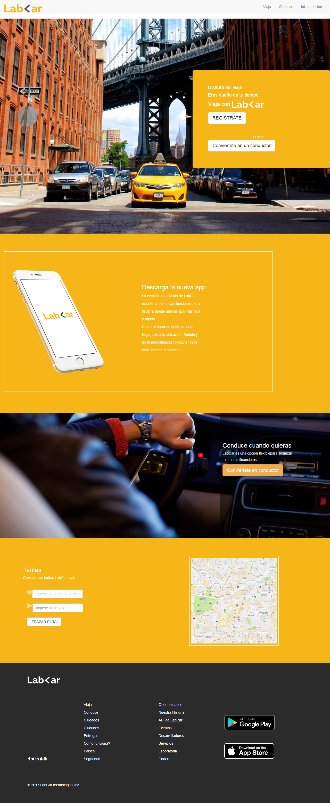

# Lab<ar
---

Lab<ar es un proyecto de maquetación en el cual aprendí a utilizar un framework y simula una pagina de viajes en taxis.

---

- Se creo una página web usando el framework Bootstrap.

- Desarrollado para Laboratoria.
